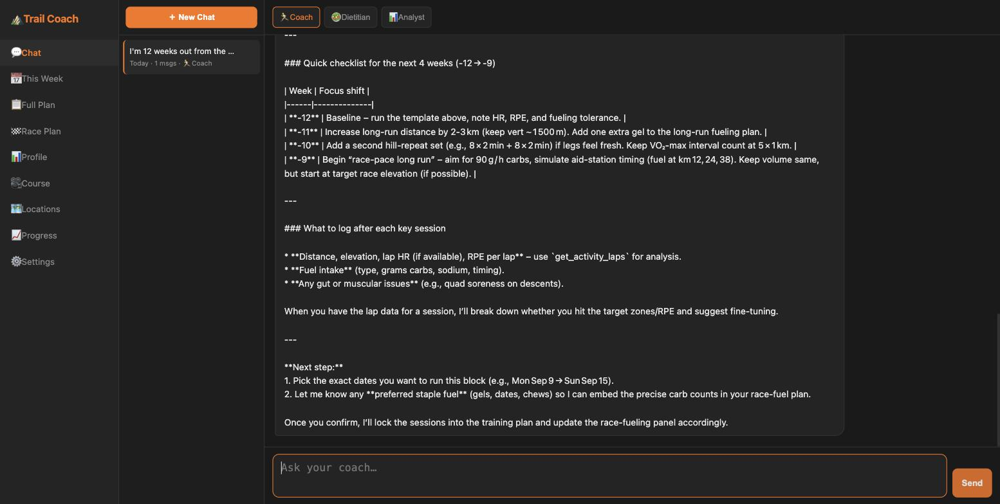
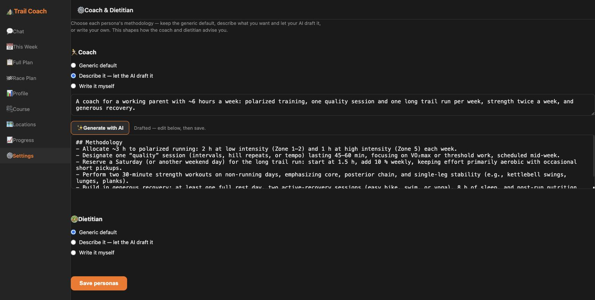
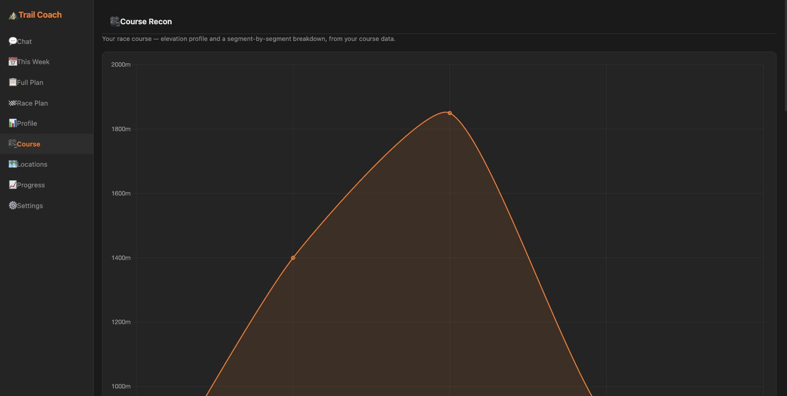
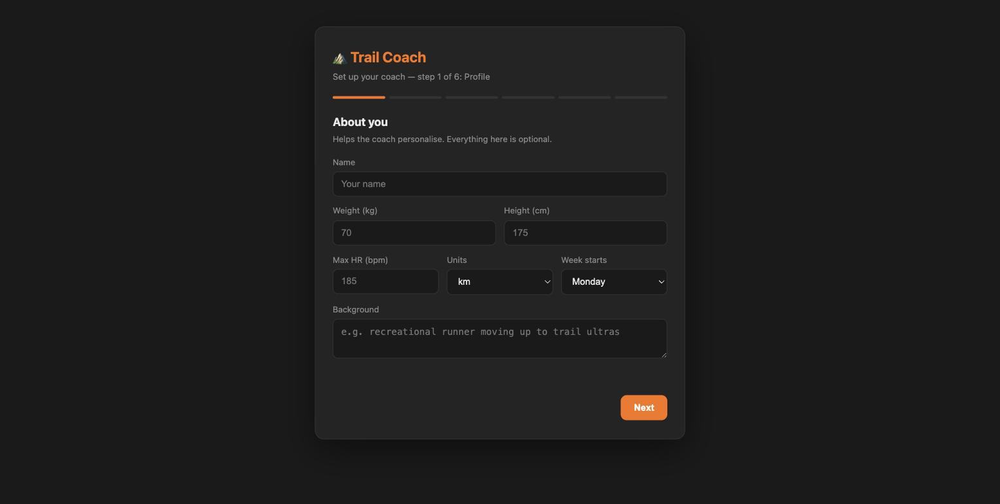

# 🏔️ Trail Coach

**An open-source, self-hostable AI trail-running coach.** Bring your own race, plan, and activity data — it coaches you toward your goal.

[](LICENSE)


Trail Coach is a single-tenant web app (installable PWA) that pairs a training-plan/week engine with an AI coach that actually knows your race — its course profile, aid stations, cutoffs, and per-segment fueling. It started as a personal coach for one athlete's UTMB OCC build and has been generalized so **anyone can clone it, wire in their own LLM and race, and self-host it**.

> **🔎 [Live demo](https://trail-coach-nwkv.onrender.com/)** — password `demo` &nbsp;·&nbsp; a sample-data instance, nothing to wire up _(free tier — first load may take ~30s to wake)_.

---

## Highlights

- **🤖 Pluggable AI provider** — Anthropic, OpenAI, Gemini, Groq, or any OpenAI-compatible / local endpoint (Ollama, LM Studio, OpenRouter) via [LiteLLM](https://github.com/BerriAI/litellm). Bring your own key and model.
- **🧑‍🏫 Three coaching personas** — a **Coach** (plan + sessions), a **Dietitian** (evidence-based fueling + a per-segment race fuel plan), and an **Analyst** (data-grounded "are you on track?" predictions) — all with tool-calling over your real training data.
- **🎛️ Build your own coach & dietitian** — each persona's methodology is yours to define: keep the generic default, **describe the expert you want and let your configured LLM draft the methodology**, or write your own. No named experts baked in.
- **🏗️ The coach builds your plan** — set your goal race and the coach generates a periodized training plan (base → build → peak → taper) toward it; *This Week*, *Full Plan*, and the race checkpoint plan all follow. Or bring your own plan CSV.
- **🗺️ Trail-native** — course elevation profiles, aid stations, cutoffs, climb/descent pacing, and per-segment carb planning are first-class.
- **🔐 Zero-overhead auth** — a single shared password by default (no Google Cloud project needed); optional Google OAuth.
- **🧭 First-run onboarding + Settings** — a setup wizard writes your athlete profile, goal, plan, course, activity source, and coaching style; a **Settings** page lets you retarget the race and rebuild the coach/dietitian personas anytime. No code editing.
- **🏃 Flexible activity source** — Strava integration, or manual entry; the plan/week engine is source-agnostic.
- **☁️ SQLite or Postgres** — runs on local SQLite out of the box; point `DATABASE_URL` at managed Postgres (e.g. Neon) for cloud deploys.

---

## Screenshots

| AI coach — grounded in your real training data | Build your coach — describe it, your LLM drafts it |
|:---:|:---:|
| [](docs/screenshots/coach-chat.jpg) | [](docs/screenshots/persona-builder.jpg) |
| **Your race course profile** | **Guided first-run onboarding** |
| [](docs/screenshots/course-profile.jpg) | [](docs/screenshots/onboarding.jpg) |

---

## Quick start (local)

Requires **Python 3.10+**.

```bash
git clone https://github.com/yosiost/trail-coach.git
cd trail-coach
python -m venv .venv && source .venv/bin/activate
pip install -r requirements.txt

cp .env.example .env
# Edit .env — at minimum set:
#   LLM_PROVIDER / LLM_MODEL / LLM_API_KEY   (or ANTHROPIC_API_KEY)
#   SECRET_KEY                                (python -c "import secrets; print(secrets.token_hex(32))")
#   APP_PASSWORD                              (your login password)
#   FLASK_DEBUG=1                             (for local dev)

python server.py
```

Open <http://localhost:7432>, sign in with your `APP_PASSWORD`, and the **onboarding wizard** walks you through the rest.

> **Just want to look around?** Set `SEED_DEMO_DATA=1` to boot with a generic example athlete, goal, and course (the fictional "Skyline 50K") instead of onboarding.

---

## Deploy (cloud)

The app ships with a `Procfile` (`gunicorn server:app`) and works on any Python host — Render, Railway, Fly.io, etc.

**One-click (Render Blueprint):** this repo includes a [`render.yaml`](render.yaml) that provisions a web service **and** a Postgres database. In Render: **New → Blueprint**, point it at your fork, then set the two dashboard secrets (`APP_PASSWORD` and `LLM_API_KEY`).

**Manual (any host):**

1. Create a **Postgres** database (e.g. [Neon](https://neon.tech)) and copy its connection string.
2. Create a web service from this repo. Build: `pip install -r requirements.txt`. Start: the `Procfile` is used automatically.
3. Set environment variables (see [Configuration](#configuration)) — at minimum `SECRET_KEY`, `APP_PASSWORD`, an LLM key, and `DATABASE_URL`.
4. Deploy, open the URL, sign in, and onboard.

Want a public sample-data demo instead of a private instance? See **[docs/DEMO.md](docs/DEMO.md)**.

> **Production note:** `SECRET_KEY` is **required** when not in debug — the app refuses to boot without it, so sessions are never signed with a default key.

---

## Configuration

All configuration is via environment variables (see [`.env.example`](.env.example) for the annotated list).

| Variable | Purpose |
|----------|---------|
| `LLM_PROVIDER` / `LLM_MODEL` | Provider slug + model id (e.g. `anthropic` + `claude-sonnet-4-6`, `openai` + `gpt-4o`). |
| `LLM_API_KEY` | Key for the chosen provider. Falls back to the provider's own env var (e.g. `ANTHROPIC_API_KEY`) if blank. |
| `LLM_BASE_URL` | For OpenAI-compatible / local endpoints (Ollama, LM Studio, OpenRouter). |
| `COACH_METHODOLOGY` / `DIETITIAN_METHODOLOGY` | `generic` (default) \| `custom` (with `*_METHODOLOGY_TEXT`). Usually set in-app via onboarding/Settings — including a "describe it, the LLM drafts it" builder — rather than here. |
| `SECRET_KEY` | Signs session cookies. **Required in production.** |
| `AUTH_MODE` | `password` (default) \| `oauth` \| `none`. |
| `APP_PASSWORD` | The login password for `AUTH_MODE=password`. |
| `GOOGLE_CLIENT_ID` / `GOOGLE_CLIENT_SECRET` / `ALLOWED_EMAILS` | For `AUTH_MODE=oauth`. |
| `DATABASE_URL` | Postgres URL for cloud; blank uses local SQLite. |
| `STRAVA_*` | Optional Strava integration (run `scripts/strava_setup.py`). |
| `SEED_DEMO_DATA` | `1` seeds a generic demo instead of onboarding. |

---

## How it works

```
┌──────────────┐   HTTPS    ┌───────────────────────────────────────┐
│  PWA frontend │ ─────────▶ │  Flask app (server.py)                │
│  (vanilla JS) │            │  · auth gate  · onboarding  · SSE chat │
└──────────────┘            └───────────────────────────────────────┘
                                    │              │
                        ┌───────────▼──┐    ┌──────▼──────────────┐
                        │  api/llm.py   │    │  api/chat.py         │
                        │  LiteLLM      │◀───│  3 personas + tools  │
                        │  (any model)  │    │  (tool-calling loop) │
                        └───────────────┘    └──────┬──────────────┘
                                                    │
                    ┌───────────────┬───────────────┼───────────────┐
                    ▼               ▼               ▼               ▼
              api/db.py      api/strava.py    config_blobs      athlete_
              goals /        plan + week      (plan CSV,        references
              predictions    engine           course JSON)      (knowledge base)
              (SQLite/PG)
```

- **Provider-agnostic LLM** (`api/llm.py`) — tools are authored once in Anthropic's schema and translated to the OpenAI function-calling format LiteLLM normalizes on, so the same coach runs on any provider.
- **Personas as data, not prose** (`api/chat.py`) — the persona prompts are athlete-agnostic; the athlete's profile, HR zones, course, and fueling are injected at request time from the database knowledge base + goal + course JSON. Methodology is a swappable preset.
- **Your data lives in the DB** — the training plan (CSV) and course (JSON) are stored in `config_blobs`; goals, predictions, fueling, and the athlete knowledge base are first-class tables. Nothing personal is committed to the repo.
- **Onboarding** (`api/onboarding.py`) — a first-run wizard validates and persists everything, deriving HR zones from your max HR and week boundaries from your week-start day.
- **Plan generation** (`api/planner.py`) — from your goal + course + profile, the LLM writes the *training content* as structured weeks while the app does all the *date math*, rendering the plan CSV the engine reads. Reliable by design: dates never depend on the model.

---

## Project layout

```
trail-coach/
├── server.py            # Flask app: routes, auth, onboarding, SSE chat
├── api/
│   ├── llm.py           # provider-agnostic LLM access (LiteLLM)
│   ├── chat.py          # coach/dietitian/analyst personas + tool-calling
│   ├── db.py            # SQLite/Postgres persistence
│   ├── onboarding.py    # first-run setup: validation + persistence
│   ├── planner.py       # generate a training plan from the goal (LLM + date math)
│   ├── persona.py       # per-persona methodology config + LLM builder
│   ├── strava.py        # plan/week engine + Strava activities (optional)
│   └── garmin.py        # legacy Garmin support (optional)
├── frontend/            # installable PWA (vanilla JS, no build step)
├── examples/            # generic sample plan + course (Skyline 50K)
├── scripts/             # setup helpers (Strava OAuth, etc.)
├── Procfile             # gunicorn entrypoint
└── .env.example         # annotated configuration
```

---

## Tech stack

Python · Flask · gunicorn · LiteLLM · SQLite / PostgreSQL · vanilla-JS PWA · Chart.js · Server-Sent Events for streaming chat.

---

## License

[MIT](LICENSE) © 2026 Yosi Ostroviak
